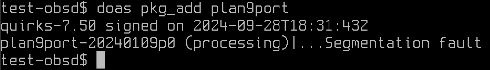

# werc-on-openbsd

Automate [Werc](http://werc.cat-v.org/) setup on [OpenBSD](https://www.openbsd.org/).

Both the `setup.sh` and `unsetup.sh` scripts (in their current version) have been successfully tested on OpenBSD 7.5. Prior or later versions of OpenBSD may not work.

**Performing an OpenBSD release upgrade (e.g. by using [sysupgrade(8)](https://man.openbsd.org/sysupgrade.8)) or updating the plan9port package may break the current Werc installation.** It is advised to always test your Werc installation after performing either a system upgrade or a plan9port update, and to reinstall Werc (using the two scripts) when it stops working.

To preserve the original config files that are going to be modified, the setup script makes a copy (backup) of them and adds `.bk` at the end of their name. For example, the original `/etc/httpd.conf` file is copied to `/etc/httpd.conf.bk`. To restore the original files, the unsetup script renames the backup files with their original name. For this reason, **before running `setup.sh`, make sure to NOT have `/etc/httpd.conf.bk` or `/etc/fstab.bk` in your filesystem.**

## Rationale and Details

[Werc](http://werc.cat-v.org/), defined as a "sane web anti-framework", is a set of [CGI](https://en.wikipedia.org/wiki/Common_Gateway_Interface) scripts that take markdown files and HTML templates and spit out a complete HTML page. It is simple (highly functional core is 150 lines), easily extensible, and fast enough.

Werc is quite popular among the [Plan 9](https://en.wikipedia.org/wiki/Plan_9_from_Bell_Labs) (and [9front](https://9front.org/)) users. Two possible and logical reasons are that:

1. It was written using Plan 9's default shell, [Rc](https://p9f.org/sys/doc/rc.html).
2. Like I said before, it is simple, and Plan 9 folks like simplicity.

I didn't have much knowledge or experience with Plan 9 at the time. However, I did have knowledge and experience with Unix-like systems (a lot more, compared to Plan 9) and I knew about the existence of [plan9port](https://9fans.github.io/plan9port/), a port of the Plan 9 user space to Unix-like systems (thank you [Russ Cox](https://swtch.com/~rsc/)). A Unix-like operating system and plan9port were all I needed to make Werc work outside of Plan 9. On one hand, an operating system family that I was familiar with. On the other, the simplicity of Werc and the Plan 9 user space.

The choice I made regarding the specific operating system to use was backed by one main thought: *if it is exposed to the internet, it must be **secure***. I could have chosen Linux, but OpenBSD is much more closely related to Unix (Unix as it was intended by its creators), and it has way stricter policies regarding security.

Another thing I really cared about, back when I started writing this script, is that it had to have the least external dependencies possible. In other words, with the reasonable exception of plan9port, it only had to use things that were already available in the default OpenBSD install. I took this decision for two reasons: the first is that I hate when something installs a zillion dependencies and bloats your system, the second is that external dependencies may introduce security breaches.

In addition to all I said before, and this was by far the hardest goal to achieve, it had to comply with OpenBSD's [httpd](https://man.openbsd.org/httpd) way of doing things. That is, the hosted website had to be `chroot`'ed into `/var/www`, so that potential breaches would only be limited to that portion of the file system. At first, since [symlinks](https://en.wikipedia.org/wiki/Symbolic_link) cannot be accessed from a `chroot`'ed environment, I solved it the naïve way: I just copied all the Plan 9 utilities, together with their dependencies, into `/var/www`. That was not the best solution, not even close, but it worked for a while. With recent changes now everything is just [hard links](https://en.wikipedia.org/wiki/Hard_link), which consume way less data on disk. I'm happy with this new solution and I don't think I will change it any time soon.

## How-To

The following procedures download scripts using the latest release's tarball, which is usually tested before publication. Although it is NOT recommended, you can download the scripts from the main branch with the following command

```
ftp https://raw.githubusercontent.com/EdoardoLaGreca/werc-on-openbsd/main/<script>
```

where `<script>` needs to be replaced with the appropriate script name.

### ⚠️ IMPORTANT: OpenBSD 7.6

The script won't work for OpenBSD 7.6 (installed with its default options) due to an error (segmentation fault) that occurs when issuing the command to install the `plan9port` package.

Of the two packages required by the setup script, `plan9port` and `bzip2`, only `plan9port` is affected by this issue.

At the moment, this is the only known issue that prevents the script from successfully terminating.

[possible bug report?](https://marc.info/?l=openbsd-bugs&m=172839281424784&w=2)



#### Temporary workaround

A temporary workaround is to manually install plan9port ([guide]()) into `/usr/local/plan9` and to replace the command that installs `plan9port` and `bzip2` (`pkg_add ...`) with one that only installs `bzip2`. The rest of the script should be good if unchanged.

This workaround has not been tested. Proceed with caution and report all the bugs you find.

### Setup

1. download the latest release tarball and extract it
    ```sh
    ftp https://github.com/EdoardoLaGreca/werc-on-openbsd/archive/refs/tags/v1.2.tar.gz
    tar -xzf v1.2.tar.gz
    cd werc-on-openbsd-1.2
    ```
2. verify its checksum (see [Checksums](#checksums))
    ```sh
    sha256 -q setup.sh
    ```
3. change the `domain` variable (and `webdir` if necessary) in `setup.sh`
4. make it executable
    ```
    chmod 744 setup.sh
    ```
5. start the script as root
    ```sh
    doas ./setup.sh
    ```

### Un-setup

1. download the latest release tarball and extract it
    ```sh
    ftp https://github.com/EdoardoLaGreca/werc-on-openbsd/archive/refs/tags/v1.2.tar.gz
    tar -xzf v1.2.tar.gz
    cd werc-on-openbsd-1.2
    ```
2. verify its checksum (see [Checksums](#checksums))
    ```sh
    sha256 -q unsetup.sh
    ```
3. change the `domain` and `webdir` variables as they were in `setup.sh`
4. make it executable
    ```
    chmod 744 unsetup.sh
    ```
5. start the script as root
    ```sh
    doas ./unsetup.sh
    ```

## Checksums

### `setup.sh`

SHA-256: `f11ddd1dd6ba82f002dbbc8e756ea090b99715fb9d23b6803594008fb3f49451`

### `unsetup.sh`

SHA-256: `0524bab3fc6c5b0f1e9ffe4d953df3c94d456b70bff6746f3545b1574e770c90`
